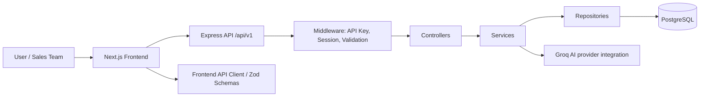
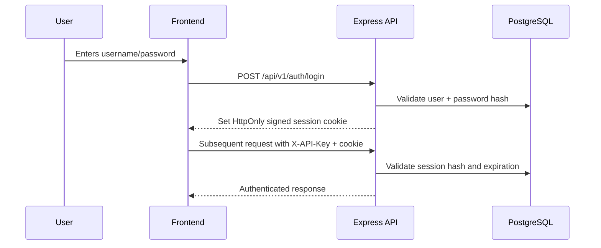
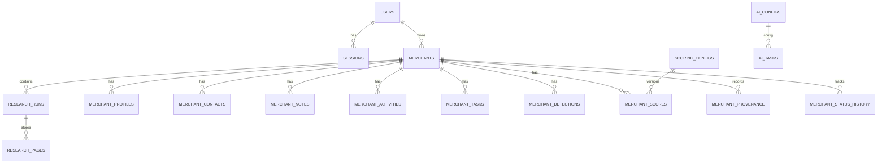

# SurePath Growth Engine

## 1. Document Information

- Project name: SurePath Growth Engine
- Project type: B2B merchant discovery, research, scoring, and sales CRM platform
- Documentation purpose: Describe the actual implementation present in the current repository and clearly mark unsupported or partial functionality
- Documentation version: Not specified in the repository
- Last updated date: Not specified in the repository
- Current project status: Active development; backend services and frontend dashboard flows are present, but several features are partial, mock-backed, or configuration-driven rather than fully production-hardened

This document reflects the implementation present in the current repository and intentionally avoids claims that are not verified in code.

## Table of Contents

1. [Document Information](#1-document-information)
2. [Executive Summary](#2-executive-summary)
3. [Project Objectives](#3-project-objectives)
4. [Product Capabilities](#4-product-capabilities)
5. [Technology Stack](#5-technology-stack)
6. [High-Level System Architecture](#6-high-level-system-architecture)
7. [Application Flow](#7-application-flow)
8. [Authentication & Authorization](#8-authentication--authorization)
9. [User Roles & Permissions](#9-user-roles--permissions)
10. [Dashboard](#10-dashboard)
11. [Merchant Management](#11-merchant-management)
12. [Merchant Data Model](#12-merchant-data-model)
13. [Merchant Research](#13-merchant-research)
14. [Profile Generation](#14-profile-generation)
15. [Technology / Provider Detection](#15-technology--provider-detection)
16. [Merchant Scoring](#16-merchant-scoring)
17. [Pipeline & CRM](#17-pipeline--crm)
18. [Pipeline Processing / Orchestration](#18-pipeline-processing--orchestration)
19. [AI Features](#19-ai-features)
20. [API Architecture](#20-api-architecture)
21. [Frontend Architecture](#21-frontend-architecture)
22. [Backend Architecture](#22-backend-architecture)
23. [Middleware](#23-middleware)
24. [Validation](#24-validation)
25. [Database Architecture](#25-database-architecture)
26. [Database Migrations](#26-database-migrations)
27. [Frontend ↔ Backend Integration](#27-frontend--backend-integration)
28. [Export Functionality](#28-export-functionality)
29. [Error Handling](#29-error-handling)
30. [Security](#30-security)
31. [Environment Variables](#31-environment-variables)
32. [Deployment Architecture](#32-deployment-architecture)
33. [Development Setup](#33-development-setup)
34. [Repository Structure](#34-repository-structure)
35. [API Response & Error Standards](#35-api-response--error-standards)
36. [UI / Screen Documentation](#36-ui--screen-documentation)
37. [Current Implementation Status](#37-current-implementation-status)
38. [Known Limitations](#38-known-limitations)
39. [Future Enhancement Areas](#39-future-enhancement-areas)
40. [Glossary](#40-glossary)
41. [Technical Reference](#41-technical-reference)
42. [Documentation Notes](#42-documentation-notes)

---

## 2. Executive Summary

SurePath Growth Engine is an internal merchant-intelligence and sales-operations platform designed to help a team discover merchants, research them, generate structured merchant profiles, detect provider or technology signals, score merchant fit, and manage sales workflow activities.

From the repository, the product is clearly aimed at a B2B merchant pipeline. The application is split into two main parts:

- `surepath-frontend/`: a Next.js dashboard and operational UI
- `surepath-backend/`: an Express + PostgreSQL API layer that stores merchant data, research results, scoring data, tasks, and configuration

### Business purpose

The platform supports a typical merchant intelligence workflow:

1. Discover merchants
2. Research merchant websites
3. Build merchant profiles from collected content
4. Look for provider or technology signals
5. Apply deterministic scoring rules
6. Enrich data with AI-configured tasks
7. Manage CRM activities, tasks, and follow-ups

### Current scope

The repository includes working backend routes and a dashboard front end with merchant, sales, pipeline, dashboard, and settings pages. The codebase is broad and not just a placeholder. However, it is also clear that some business flows are only partially implemented or mock-backed, especially around discovery and AI automation. The project should be interpreted as an active internal tool under active development, not a fully hardened production SaaS.

### Who uses it

The code and UI strongly suggest an internal sales or operations team working with merchants and follow-ups. The user-facing language references sales stages, team settings, assigned reps, follow-ups, and merchant pipeline management.

---

## 3. Project Objectives

The following objectives are verified from the codebase:

- Maintain a merchant database with status, ownership, and follow-up metadata
- Discover new merchants and normalize their domain and metadata
- Research merchant websites and capture page content for downstream processing
- Build merchant profiles from stored research pages
- Detect provider or technology signals from research pages
- Calculate merchant fit and opportunity scores using configurable rules
- Support CRM-style tasks and merchant activities
- Provide a dashboard summarizing merchant pipeline health
- Support merchant export as CSV
- Allow AI configuration and AI task execution through versioned configurations
- Expose these operations through a versioned API layer

The repository does not define a formal business strategy document beyond the README and actual product code, so the objectives above are derived from the implemented routes, services, and screens.

---

## 4. Product Capabilities

| Feature | Description | Status |
| --- | --- | --- |
| Authentication | API key + signed session cookie flow | Implemented |
| User login | Username/password login and session creation | Implemented |
| Logout | Destroy signed session | Implemented |
| Remember me / keep signed in | Session lifetime extended to 30 days | Implemented |
| User management | Create, list, update, password reset | Implemented |
| Admin authorization | `requireAdmin` enforcement | Implemented |
| Dashboard | Merchant totals, stage counts, best prospects | Implemented |
| Merchant list | Search, filter, pagination, export | Implemented |
| Merchant create | Add a new merchant | Implemented |
| Merchant edit | Update merchant fields | Implemented |
| Merchant delete | Delete merchant record | Implemented |
| Merchant detail view | Status, assignee, follow-up, summary | Implemented |
| Merchants by stage | Stage-based pipeline tracking | Implemented |
| Merchant research | Website pages and content collection | Implemented |
| Profile generation | Structured profile from research pages | Implemented |
| Provider detection | Static rules for known providers | Implemented |
| Scoring | Fit/opportunity score generation | Implemented |
| AI configuration | Versioned AI tasks and model settings | Implemented |
| AI enrichment run | Executes configured AI tasks for merchants | Partially Implemented |
| Discovery pipeline | Auto-discovery of merchants | Partially Implemented |
| Pipeline orchestration UI | Staged workflow runner | Implemented |
| Sales CRM | Tasks, merchants, follow-ups, stage tracking | Implemented |
| Export | CSV export of merchants | Implemented |
| Deployment setup | Infrastructure/deployment configuration | Not Found |
| OpenAPI docs | Swagger/OpenAPI schema | Not Found |
| Automated tests | Test suite | Not Found |

---

## 5. Technology Stack

### 5.1 Frontend

| Technology | Version | Purpose |
| --- | --- | --- |
| Next.js | 16.3.4 | App Router frontend framework |
| React | 19.2.8 | UI layer |
| TypeScript | 5.x | Type safety |
| Tailwind CSS | 4.x | Utility-first styling |
| Axios | ^1.20.0 | API calls |
| Zod | ^4.6.5 | Client-side schema validation |
| Zustand | ^5.0.15 | State management package present but not heavily used in code review |
| @tanstack/react-query | ^5.103.0 | Async data fetching library present in package manifest |
| Sonner | ^2.0.8 | Toast notifications |
| Lucide React | ^1.40.0 | Icons |
| Radix UI primitives | Included via `radix-ui` and UI components | Interactive UI pieces |

### 5.2 Backend

| Technology | Version | Purpose |
| --- | --- | --- |
| Node.js | runtime via package manifest | JavaScript runtime |
| Express | ^5.2.1 | Web API server |
| TypeScript | ^5.9.3 | Type-safe backend development |
| PostgreSQL | Used via `pg` | Primary relational database |
| `pg` | ^8.23.0 | PostgreSQL client |
| `bcrypt` | ^6.0.0 | Password hashing |
| `dotenv` | ^17.4.2 | Environment variable loading |
| `cors` | ^2.8.6 | Cross-origin support |
| `express-validator` | ^7.3.2 | Request validation |
| `node-pg-migrate` | ^9.0.0 | Database migrations |
| `groq-sdk` | ^1.6.0 | AI SDK integration used by AI provider layer |
| `pg-query-stream` | ^4.17.0 | CSV export streaming |

### 5.3 Database

| Technology | Status | Notes |
| --- | --- | --- |
| PostgreSQL | Implemented | Primary persistence layer |
| SQL migrations | Implemented | Under `surepath-backend/migrations/` |
| JSONB fields | Used | `scoring_configs`, `ai_configs` and related config tables use JSONB |
| Transactions | Implemented | Shared `withTransaction` helper in `src/config/database.ts` |

### 5.4 Authentication & security

| Technology | Status | Notes |
| --- | --- | --- |
| API key authentication | Implemented | `X-API-Key` middleware |
| Session-based auth | Implemented | Signed cookie + DB session record |
| HMAC signing | Implemented | Session cookie is signed with `SESSION_SECRET` |
| HTTP-only cookies | Implemented | `HttpOnly; Path=/; SameSite=None; Secure` in login flow |
| Password hashing | Implemented | `bcrypt.hash` and `bcrypt.compare` |
| CORS support | Implemented | `app.use(cors({ origin: process.env.FRONTEND_URL, credentials: true }))` |

### 5.5 Infrastructure / deployment

| Area | Status |
| --- | --- |
| Docker | Not Found |
| Docker Compose | Not Found |
| Vercel config | Not Found |
| Cloud deployment manifests | Not Found |
| CI/CD configuration | Not Found |
| OpenAPI/Swagger docs | Not Found |

Not verified from the current repository.

### 5.6 Development tools

| Tool | Verified |
| --- | --- |
| TypeScript compiler | Yes (`tsc` in backend and frontend) |
| ESLint | Yes (`surepath-frontend` has `eslint` script) |
| Node-based migrations | Yes |
| Local `.env` config | Yes |

---

## 6. High-Level System Architecture

The system follows a standard layered architecture.



### Layer responsibilities

#### Frontend

The frontend is a dashboard application built with the App Router. It renders screens for login, merchants, dashboard, sales, settings, and pipeline actions.

#### API layer

The backend exposes a versioned REST API under `/api/v1`. It includes routes for authentication, merchants, users, research, profile generation, detection, scoring, AI config, industries, and sales-related tasks.

#### Middleware and validation

Routes are gated with:

- `requireApiKey`
- `requireSession`
- `requireAdmin`
- `validate`

#### Service layer

The service layer implements business logic such as merchant creation, scoring calculation, AI configuration loading, detection, profile generation, and discovery execution.

#### Repository layer

Repositories issue SQL through `pg` against PostgreSQL. They are the direct boundary between business logic and the database.

#### Database

The database stores users, sessions, merchants, research runs/pages, profiles, contacts, notes, tasks, scores, AI configs, industries, and provenance metadata.

---

## 7. Application Flow

The repository implements a merchant intelligence flow that is mostly consistent with the project description.

```text
Login
  ↓
Dashboard
  ↓
Merchant Listing / Merchant Detail
  ↓
Discovery (optional)
  ↓
Research
  ↓
Profile Generation
  ↓
Provider Detection
  ↓
Scoring
  ↓
AI Enrichment
  ↓
Sales / CRM follow-up
```

### Verified flow in code

- Frontend login page posts to `/api/v1/auth/login`.
- Successful login sets a signed session cookie.
- Authenticated pages check current user state through `AuthProvider` and `AuthGuard`.
- Dashboard loads merchants and score/research metadata.
- Merchant list supports add, search, filter, export, and delete actions.
- Merchant detail page loads merchant summary, detections, scores, and contacts.
- Pipeline page orchestrates the sequence of discovery, research, profile, detection, scoring, and optional AI tasks.
- Sales page summarizes tasks and follow-up work by assigned user.

This flow is implemented in the frontend route files and backend route/service packages, although one or more stages can be mock-backed or partial.

---

## 8. Authentication & Authorization

### 8.1 Authentication flow

The project implements a two-layer API authentication pattern.



### 8.2 Verified auth mechanisms

#### API key authentication

Implemented in `src/middleware/api-key.middleware.ts`.

- Reads `X-API-Key` header
- Compares it against `process.env.API_KEY`
- Returns `401` if missing or invalid

#### Session authentication

Implemented in `src/middleware/auth.middleware.ts`.

- Reads the `surepath_session` cookie
- Verifies the HMAC signature using `SESSION_SECRET`
- Compares the reconstructed token hash against the `sessions` table
- Checks expiry time
- Loads the user and attaches `req.user`

#### Login flow

Implemented in:

- `src/controllers/auth.controller.ts`
- `src/services/auth.service.ts`
- `src/repositories/auth.repository.ts`

The login flow:

- checks username/password
- ensures the user is active
- creates a random session token
- stores a SHA-256 hash of the token in `sessions`
- sets a signed cookie with `HttpOnly; SameSite=None; Secure`
- returns the user object in the response

#### Logout flow

Implemented in `logout` controller and service.

- Reads the session cookie
- Extracts the raw token
- Hashes it and deletes the matching session row
- Clears the browser cookie

#### Keep signed in

Implemented in `auth.controller.ts` and `auth.service.ts`.

- `keepSignedIn` toggles session duration:
  - default: 1 day
  - keep signed in: 30 days

### 8.3 Authorization middleware

Implemented in:

- `src/middleware/role.middleware.ts`

The middleware checks `req.user.role === "admin"` and returns `403` otherwise.

### 8.4 Current status of auth

| Area | Status |
| --- | --- |
| API key auth | Implemented |
| Session validation | Implemented |
| Cookies | Implemented |
| Expiration | Implemented |
| Admin auth | Implemented |
| Keep me signed in | Implemented |
| Request validation on login | Not implemented |
| Central app-wide error middleware | Not visible in `src/app.ts` |

---

## 9. User Roles & Permissions

The user model includes a `role` field and is stored in `users`.

| Role | Verified permissions | Protected areas |
| --- | --- | --- |
| `admin` | Can access admin-only user management routes and AI config update route | `src/routes/user.routes.ts`, `src/routes/ai.routes.ts` |
| `user` or other non-admin | Session-authenticated user access only | Most merchant and CRM routes require session but not admin |

### Verified route protection patterns

| Route family | Middleware applied |
| --- | --- |
| `/api/v1/auth/*` | `requireApiKey`, `requireSession` on logout/password |
| `/api/v1/users/*` | `requireApiKey`, `requireSession`, `requireAdmin` for list/create/update/reset routes |
| `/api/v1/merchants/*` | `requireApiKey`, `requireSession` |
| `/api/v1/ai/configs` | `requireApiKey`, `requireSession`, `requireAdmin` for update route |
| `/api/v1/scoring/config` update | `requireSession` but not admin in route file |

The repository does not define a richer RBAC model with tenant, department, or org boundaries. That should be treated as not verified beyond the basic admin flag.

---

## 10. Dashboard

### Business purpose

The dashboard gives an internal user a summary of merchant pipeline health and sales readiness.

### Route

- `surepath-frontend/src/app/(dashboard)/dashboard/page.tsx`

### Data source

The dashboard calls `getDashboardData()` from `src/features/dashboard/api/dashboard.api.ts`.

This function:

- requests merchants with a limit of 100 and offset 0
- fetches score rows per merchant
- fetches research runs per merchant
- totals stage counts by merchant `status`
- calculates scored and awaiting-research counts
- identifies best prospects by latest score

### Metrics shown

- total merchants
- scored merchant count
- awaiting research count
- merchants by stage
- best prospects ranked by score

### UI elements

- summary stat cards
- stage breakdown cards
- link to pipeline
- table/list of top prospects

### Loading / error states

The page uses `useState` for loading and error, and renders a message while data loads.

### Status

Implemented as a working dashboard screen, but the data is loaded from the actual backend API rather than static mock content in the current implementation.

---

## 11. Merchant Management

### Business purpose

Merchant management is the central operational domain for the application. It covers creation, update, list filtering, assignment, follow-up, status change, and deletion.

### Verified merchant routes

| Method | Endpoint | Purpose | Auth |
| --- | --- | --- | --- |
| GET | `/api/v1/merchants` | List merchants with filters and pagination | API key + session |
| POST | `/api/v1/merchants` | Create merchant | API key + session |
| GET | `/api/v1/merchants/:id` | Fetch merchant by ID | API key + session |
| PATCH | `/api/v1/merchants/:id` | Update merchant | API key + session |
| DELETE | `/api/v1/merchants/:id` | Delete merchant | API key + session |

### Merchant list functionality

Implemented in:

- `src/routes/merchant.routes.ts`
- `src/controllers/merchant.controller.ts`
- `src/services/merchant.service.ts`
- `src/repositories/merchant.repository.ts`
- `surepath-frontend/src/app/(dashboard)/merchants/page.tsx`

Features shown by the frontend:

- search by query string
- status filter
- country filter
- industry filter
- owner/assignee filter
- pagination
- export to CSV
- add merchant dialog
- delete merchant dialog

### Merchant creation

The backend `createMerchant` flow:

- normalizes domain via `normalizeDomain`
- rejects duplicates by domain
- inserts a record into `merchants`

### Merchant editing

The backend update flow:

- loads existing merchant
- records status change history if status changes
- optionally updates `outcome_reason` and `outcome_at` if preserved
- persists to database with transaction

### Merchant detail page

The frontend merchant detail page loads:

- merchant summary details
- score history
- detections
- contacts
- notes via tabs
- activities/tasks via tabbed views

### Merchant assignment and follow-up

The merchant table and detail page support:

- assigned rep
- next follow-up date
- sales stage status
- outcome state

### Export functionality

Merchant export is implemented and triggered in the merchant list page.

---

## 12. Merchant Data Model

The merchant record is defined in `surepath-backend/migrations/007_create_merchants.sql` and the backend types under `src/types/merchant.types.ts`.

| Field | Type | Required | Description |
| --- | --- | --- | --- |
| `id` | UUID | Yes | Primary key |
| `domain` | VARCHAR(255) | Yes | Merchant domain, unique |
| `platform` | VARCHAR(100) | No | Platform or channel of merchant |
| `store_name` | VARCHAR(255) | No | Store display name |
| `country` | VARCHAR(100) | No | Merchant country |
| `industry` | VARCHAR(100) | No | Industry classification |
| `status` | VARCHAR(100) | Yes | Stage/status such as `New`, `Live`, `Lost` |
| `assigned_rep_id` | UUID | No | Assigned sales representative |
| `next_follow_up_at` | TIMESTAMPTZ | No | next follow-up date |
| `outcome_reason` | TEXT | No | Reason for outcome |
| `outcome_at` | TIMESTAMPTZ | No | Time outcome was set |
| `last_activity_at` | TIMESTAMPTZ | No | Last activity timestamp |
| `source` | VARCHAR(100) | No | Source of merchant record |
| `created_at` | TIMESTAMPTZ | Yes | Creation timestamp |
| `updated_at` | TIMESTAMPTZ | Yes | Last update |

### Related merchant child records

The system also stores child data such as:

- `merchant_profiles`
- `merchant_contacts`
- `merchant_notes`
- `merchant_activities`
- `merchant_tasks`
- `merchant_detections`
- `merchant_scores`
- `merchant_status_history`
- `merchant_provenance`

These are implemented in the migration files and repository layers.

---

## 13. Merchant Research

### Business purpose

Merchant research collects website content that can later be used to generate merchant profiles, detect provider technology, and score merchant quality.

### Trigger and API

The research trigger is implemented as:

- `POST /api/v1/research/run`
- `src/controllers/research.controller.ts`
- `src/services/research-run.service.ts`

### Data collection model

The database stores:

- `research_runs` — an execution record for each research batch
- `research_pages` — each fetched page and its content metadata

### Page behaviors verified from code

The service checks robots rules, fetches standard pages, and persists results. The actual research implementation is more focused on a basic website crawl than robust industrial scraping.

#### Verified pages requested

The code includes a fixed set of paths such as:

- `/`
- `/products.json`
- `/about`
- `/contact`
- `/shipping`
- `/returns`
- `/refund-policy`
- `/privacy-policy`
- `/terms`

The fetch logic is implemented in `src/services/research.service.ts` and the run orchestration in `src/services/research-run.service.ts`.

### Research statuses

The `research_runs` table uses statuses such as:

- `running`
- `completed`
- `failed`

The `research_pages` table uses status values such as:

- `found`
- `missing`
- `failed`

### Frontend usage

The frontend pipeline page calls research routines as one stage in the merchant pipeline. It shows stage progress and errors if a research run fails.

### Status

Implemented, but not a hardened production crawler. The code does not show full SSRF protections, aggressive URL validation, domain allowlists, or a robust rate-limited crawler architecture.

---

## 14. Profile Generation

### Business purpose

Profile generation turns research results into a structured profile with summary fields, contact details, and policy excerpts.

### Trigger and API

- `POST /api/v1/profiles/run`
- `src/controllers/profile-run.controller.ts`
- `src/services/profile-generation.service.ts`

### Input source

The generation process uses the latest completed research pages for a merchant and extracts facts such as:

- company name
- description
- shipping policy
- return policy
- contact email
- contact phone

### Database output

The code writes to `merchant_profiles` and may create a merchant contact when a research contact is identified.

### Extraction behavior

The service cleans HTML content via regex and extracts values from page content and page titles. This is a rule-based extraction process, not a generalized NLP pipeline.

### Current status

Implemented. It is functionally present, but it is a limited, rules-based extraction flow rather than a production-grade entity extraction engine.

---

## 15. Technology / Provider Detection

### Business purpose

The application detects known merchant protection providers from website content and supports evidence trails for each detection.

### Trigger and API

- `POST /api/v1/detections/run`
- `src/services/detection-run.service.ts`
- `src/services/provider-detection.service.ts`

### Detection model

The detection logic uses static rule-based checks for known providers. The code contains checks for several vendors, including examples such as Route, Corso, SEEL, Navidium, Extend, and Order Protection.

### Signal types

The detection logic looks for patterns such as:

- asset host Indicators
- explicit provider phrases in page text
- presence in `/products.json`

The code includes confidence values based on the signal type.

### Storage

Detection results are persisted in `merchant_detections`.

### Current status

Implemented as a rule-based detection layer. It is not a broad or adaptive detection platform; it relies on hardcoded detection rules and evidence matching in stored research content.

---

## 16. Merchant Scoring

### Business purpose

The platform calculates merchant fit scores and opportunity values so users can prioritize merchants in the pipeline.

### Trigger and API

- `POST /api/v1/scoring/run`
- `GET /api/v1/scoring/config`
- `PUT /api/v1/scoring/config`
- `GET /api/v1/scoring/configs`

### Scoring configuration

The scoring configuration is stored in `scoring_configs` and includes:

- `version`
- `scoring_factors`
- `factor_weights`
- `criteria`
- `attach_rate`
- `revenue_per_order`
- `commercial_assumptions`
- `is_active`

These fields are implemented in `surepath-backend/migrations/015_scoring_configs.sql`.

### Calculation logic

The backend service calculates score by applying scoring factors and weights against merchant data. It also calculates opportunity value when the relevant input variables exist.

The score is persisted to `merchant_scores`.

### Frontend display

The frontend merchant list and detail pages show score values and the dashboard ranks best prospects by the latest score.

### Current status

Implemented. The scoring logic is deterministic and configuration-driven, but the repository does not show a fully autonomous scoring pipeline with automatic recalculation on every config change; the UI text mentions the next scoring run takes effect when changed.

---

## 17. Pipeline & CRM

### Business purpose

The system includes a sales and pipeline workflow for moving merchants through sales stages and maintaining relationship context.

### Pipeline stages

The frontend pipeline page defines stage names such as:

- Discovery
- Research
- Profile
- Detection
- Scoring
- AI Enrichment

### CRM features

The backend and frontend support:

- merchants
- contacts
- notes
- activities
- tasks
- follow-up scheduling
- sales stage tracking
- assignment to a rep

### Verified data tables

| Table | Purpose |
| --- | --- |
| `merchant_tasks` | sales and operational tasks |
| `merchant_contacts` | contact records linked to a merchant |
| `merchant_notes` | notes attached to merchant |
| `merchant_activities` | activity history |
| `merchant_status_history` | audit trail for status changes |

### Frontend screens

- `/sales`
- `/pipeline`
- `/merchants/[id]`
- `/settings`

### Status

Implemented as a functional sales pipeline and CRM workflow, although some pieces remain limited to UI/state logic or partial backend coverage.

---

## 18. Pipeline Processing / Orchestration

### Verified pipeline order

The frontend page `src/app/(dashboard)/pipeline/page.tsx` defines the stage sequence as:

- discovery (optional)
- research
- profile
- detection
- scoring
- AI (optional)

### Execution model

The pipeline executes sequentially in the frontend for a selected merchant or a discovery run, and the backend endpoints correspond to each stage.

### Verified stage dependencies

| Stage | Depends on |
| --- | --- |
| Discovery | none, or existing merchant state |
| Research | merchants available in DB |
| Profile | completed research pages |
| Detection | completed research pages |
| Scoring | active scoring config and merchant data |
| AI | active AI configs and merchant/profile context |

### Failure behavior

The pipeline page tracks stage state (`pending`, `running`, `failed`, `skipped`) and displays stage errors. It stops dependent processing when earlier stage failures occur.

### Status

Implemented in the user interface and the matching backend endpoints. Discovery defaults to a mock source, and AI is optional rather than fully mandatory in the stage chain.

---

## 19. AI Features

### Business purpose

AI is used as an enrichment layer for merchant intelligence, especially for classification and policy summarization.

### Supported tasks

From `src/services/ai-run.service.ts`, the tasks include:

- `industry_classify`
- `research_summary`
- `policy_summary`

### AI config model

`ai_configs` includes:

- `key`
- `prompt_template`
- `model`
- `params`
- `version`
- `is_active`

### AI configuration workflow

- `GET /api/v1/ai/configs` loads active configs
- `PUT /api/v1/ai/configs` updates an AI config
- Missing configs are lazily seeded using defaults in `src/services/ai-config.service.ts`

### AI provider integration

The AI provider service integrates with the Groq SDK. The code is present in `src/services/ai-provider.service.ts`.

### Current status

Partially Implemented.

The repository verifies:

- AI config storage and versioning
- AI task execution code
- provider integration layer

However, the documentation and UI do not show that AI tasks are fully integrated into the default workflow as a required pipeline stage for all merchants.

---

## 20. API Architecture

The backend exposes a versioned API at `/api/v1`.

### Route groups verified from code

| Area | Verified routes |
| --- | --- |
| Health | `GET /api/v1/health` |
| Auth | `POST /api/v1/auth/login`, `POST /api/v1/auth/logout`, `POST /api/v1/auth/password` |
| Users | `GET /api/v1/users`, `POST /api/v1/users`, `GET /api/v1/users/:id`, `PATCH /api/v1/users/:id`, `GET /api/v1/users/me` |
| Merchants | `GET /api/v1/merchants`, `POST /api/v1/merchants`, `GET /api/v1/merchants/:id`, `PATCH /api/v1/merchants/:id`, `DELETE /api/v1/merchants/:id` |
| Merchant child resources | contacts, notes, activities, tasks, detections, scores, profile, provenance |
| Research | `POST /api/v1/research/run` |
| Profiles | `POST /api/v1/profiles/run` |
| Detections | `POST /api/v1/detections/run` |
| Discovery | `POST /api/v1/discovery/run` |
| Scoring | `GET /api/v1/scoring/config`, `PUT /api/v1/scoring/config`, `POST /api/v1/scoring/run` |
| AI | `GET /api/v1/ai/configs`, `PUT /api/v1/ai/configs`, `POST /api/v1/ai/run` |
| Industries | `GET /api/v1/industries` |
| Tasks | `GET /api/v1/tasks`, `PATCH /api/v1/tasks/:id`, `DELETE /api/v1/tasks/:id` |

### Authentication in API routes

Most routes apply both `requireApiKey` and `requireSession` as appropriate. Some endpoints use API key only and do not require a session, depending on route config.

### Response standards

The backend does not appear to use one single global response envelope. The code shows different shapes such as:

- `{ data: ... }`
- `{ user: ... }`
- `{ users: ... }`
- raw arrays
- CSV file download responses
- `{ detail: [...] }` from validation failures
- `{ message: ... }` from common faults

This means the API is not strictly standardized across modules.

---

## 21. Frontend Architecture

### Frontend structure

```text
surepath-frontend/src/
├── app/
│   ├── (auth)/login/page.tsx
│   ├── (dashboard)/dashboard/page.tsx
│   ├── (dashboard)/layout.tsx
│   ├── (dashboard)/merchants/
│   ├── (dashboard)/pipeline/page.tsx
│   ├── (dashboard)/sales/page.tsx
│   └── (dashboard)/settings/page.tsx
├── components/
│   ├── layout/
│   ├── ui/
│   └── auth/
├── features/
│   ├── auth/
│   ├── dashboard/
│   ├── merchants/
│   ├── pipeline/
│   ├── sales/
│   ├── settings/
│   └── ...
├── lib/
├── data/
├── types/
└── app/layout.tsx
```

### App Router pattern

The app uses route groups:

- `(auth)`
- `(dashboard)`

These groups affect layout composition but not the URL path.

### Auth provider and guard

The dashboard shell wraps pages in:

- `AuthProvider`
- `AuthGuard`

The guard redirects unauthenticated users to `/login` when the auth state is resolved.

### API client pattern

The frontend uses `src/lib/api/client.ts` to create an Axios instance with:

- `baseURL: process.env.NEXT_PUBLIC_API_URL`
- `withCredentials: true`
- JSON content type
- `X-API-Key` header from env

### Schema validation

Feature modules use Zod schemas to parse server responses. This is implemented in feature-specific `schemas/` folders under `src/features/*`.

---

## 22. Backend Architecture

### Entry points

- `surepath-backend/src/server.ts`
- `surepath-backend/src/app.ts`

### Application startup

`server.ts` does the following:

- loads configuration via `./config/network`
- imports the Express app
- loads the database config
- bootstraps the initial admin account
- listens on `PORT` or `5000`

### Express app

`app.ts`:

- applies CORS using `FRONTEND_URL`
- parses JSON requests
- mounts versioned route groups such as `/api/v1/health`, `/api/v1/users`, `/api/v1/merchants`, `/api/v1/scoring`, `/api/v1/research`, `/api/v1/ai`, etc.
- exposes a root health-style message at `/`

### Layered backend design

```text
Route
  ↓
Middleware
  ↓
Controller
  ↓
Service
  ↓
Repository
  ↓
PostgreSQL
```

This structure is visible across the main modules, although some files bypass the strict layer pattern in places such as research-run controller and some direct SQL service calls.

---

## 23. Middleware

| Middleware | Purpose | Applied to |
| --- | --- | --- |
| `requireApiKey` | Validate `X-API-Key` header | Most API routes |
| `requireSession` | Validate signed cookie session | Authenticated routes |
| `requireAdmin` | Require admin role | Admin-only routes |
| `validate` | Check `express-validator` result | Validation-gated routes |
| CORS middleware | Enable browser cross-origin use | App-wide |

### Middleware details

#### API key middleware

- Reads `X-API-Key`
- Compares against `process.env.API_KEY`
- Returns `401` if missing or invalid

#### Session middleware

- Parses `surepath_session`
- Validates HMAC signature
- Loads session by hashed token
- Ensures session is not expired
- Loads user record
- Attaches `req.user`

#### Validation middleware

- Calls `validationResult(req)`
- Returns a `422` response with `detail` array for errors

---

## 24. Validation

### Frontend validation

The frontend uses Zod in feature-specific schemas. This validation is used to parse responses and ensure the client contracts match expected API data.

### Backend validation

The backend uses `express-validator` plus `validate` middleware.

Examples:

- `src/validators/merchant.validator.ts`
- `src/validators/auth.validator.ts`
- `src/validators/scoring-config.validator.ts`
- `src/validators/ai-config.validator.ts`

### Validation behavior

When validation fails, the backend returns a `422` with a `detail` array containing field-level issues.

### Current status

Validation is implemented in many major modules, but not uniformly across all routes. The login route does not show a validator in the route stack, and other modules vary in validation coverage.

---

## 25. Database Architecture

The system uses PostgreSQL as the primary database.

### Database access

`src/config/database.ts` creates a `Pool` from `DATABASE_URL` and includes a `withTransaction` helper that wraps `BEGIN`, `COMMIT`, and `ROLLBACK`.

### Major verified tables

| Table | Purpose |
| --- | --- |
| `users` | user accounts |
| `sessions` | signed session records |
| `merchants` | primary merchant records |
| `merchant_profiles` | merchant profile data |
| `merchant_contacts` | merchant contacts |
| `merchant_notes` | merchant notes |
| `merchant_activities` | merchant activity log |
| `merchant_tasks` | CRM tasks |
| `merchant_detections` | provider detection results |
| `merchant_scores` | score records |
| `scoring_configs` | scoring configuration |
| `research_runs` | research executions |
| `research_pages` | page-level research data |
| `merchant_provenance` | automated field provenance |
| `merchant_status_history` | status changelog |
| `industries` | approved industry list |
| `ai_configs` | AI task configuration |

### Relationship overview



### Important constraints

The migrations include:

- unique user emails
- unique merchant domains
- unique session token hashes
- foreign keys from child records to merchants
- business status checks and unique active config indexes

### Current status

Database architecture is implemented, but not a fully tenant-aware design. Multi-tenant or organization separation is not evidenced in the repository.

---

## 26. Database Migrations

### Migration system

The backend uses `node-pg-migrate` and executes migration scripts from `surepath-backend/migrations/`.

### Verified migration command

The backend `package.json` includes:

```bash
npm run migrate
```

This maps to:

```bash
node --dns-result-order=ipv4first --no-network-family-autoselection node_modules/node-pg-migrate/bin/node-pg-migrate.js up -m migrations --envPath .env
```

### Migration structure

Examples from the repository:

- `001_create_users.sql`
- `002_update_users_table.sql`
- `006_create_sessions.sql`
- `007_create_merchants.sql`
- `015_scoring_configs.sql`
- `018_research_runs_and_pages.sql`
- `022_create_ai_configs.sql`
- `023_seed_industries.sql`

### Migration scope

The migrations cover:

- users and sessions
- merchants
- profile/contact/note/task/activity records
- scoring configs and score records
- research runs/pages
- merchant provenance
- industries and AI config

### Status

Implemented.

---

## 27. Frontend ↔ Backend Integration

The frontend and backend are integrated through an Axios client and route-bound API calls.

### Request flow

```text
Frontend UI
  ↓
Axios client (`apiClient`)
  ↓
`X-API-Key` header
  ↓
Cookie session (`surepath_session`)
  ↓
Backend middleware
  ↓
Controller / Service / Repository
  ↓
PostgreSQL
```

### Frontend API client

`src/lib/api/client.ts` creates a shared Axios instance with:

- `baseURL` from `NEXT_PUBLIC_API_URL`
- `withCredentials: true`
- JSON headers
- API key in `X-API-Key`

### Frontend feature APIs

Examples:

- `src/features/auth/api/auth.api.ts`
- `src/features/merchants/api/merchants.api.ts`
- `src/features/dashboard/api/dashboard.api.ts`
- `src/features/pipeline/api/pipeline.api.ts`
- `src/features/settings/api/settings.api.ts`

### Response parsing

Many requests call Zod schema parsers before returning the data to the UI.

### Current status

The integration pattern is implemented, but some screens still rely on local component state or static data rather than a fully consistent backend-backed workflow. The codebase itself demonstrates active API integration in several modules, even while a few pages or operations are still mock-oriented.

---

## 28. Export Functionality

### Purpose

Export merchant data to CSV for downstream use or external review.

### Route

- `GET /api/v1/merchants/export`

### Frontend trigger

The merchant list page includes an Export CSV button.

### Backend implementation

The exporter uses a service and repository layer and streams the CSV result with `pg-query-stream`.

### Included data

The export process combines merchant values with score, provenance, contact, and detection data from multiple repository queries.

### Current status

Implemented.

---

## 29. Error Handling

### Frontend error handling

The UI uses:

- local `try/catch` blocks
- loading state flags
- error state strings
- Sonner toast notifications

Examples:

- login page
- merchant page
- settings page
- pipeline page

### Backend error handling

The backend uses controller-level `try/catch` and route-level validation. The app file does not show a central Express error handler in the visible application setup.

### Verified error patterns

| Error type | Format |
| --- | --- |
| Validation failure | `422` + `detail` array |
| Bad credentials | `401` |
| Not found | `404` |
| Conflict | `409` for duplicate domain |
| Permission denied | `403` |
| Database/health failure | `503` in health route |

### Current status

Error handling exists, but it is not centralized and response standards are inconsistent across modules.

---

## 30. Security

### Implemented security controls

| Control | Verified |
| --- | --- |
| Password hashing | Implemented with `bcrypt` |
| Session token hashing | Implemented using SHA-256 before storing in DB |
| HMAC session signing | Implemented |
| HTTP-only cookies | Implemented |
| Secure cookies | Used in login response |
| API key authentication | Implemented |
| Session expiration | Implemented |
| Input validation | Implemented in backend and frontend schemas |
| CORS | Implemented |

### Security gaps verified in the repo

The source code also indicates several real security and hardening gaps, including:

- some routes allow API-key-only destructive actions
- not all routes enforce admin-only access consistently
- some route-level validation is missing
- there is no centralized app-wide error middleware visible
- research workflow can fetch arbitrary domains without strong allowlist/SSRF protections in the code as written
- no visible tenant/organization boundary exists in the DB model

This is not a complete security audit, but it is a verified set of concerns based on current source.

---

## 31. Environment Variables

The repository contains environment configuration files such as `.env` in the backend and frontend. The names are verifiable from the code and config files, but secret values must not be included here.

| Variable | Purpose | Required | Sensitive |
| --- | --- | --- | --- |
| `PORT` | Backend port | Usually yes | No |
| `APP_ENVIRONMENT` | Environment name | Usually yes | No |
| `DB_HOST` | Database host | Yes for local config | No |
| `DB_PORT` | Database port | Yes for local config | No |
| `DB_NAME` | Database name | Yes for local config | No |
| `DB_USER` | Database username | Yes for local config | No |
| `DB_PASSWORD` | Database password | Yes for local config | Yes |
| `DATABASE_URL` | Connection string | Yes | Yes |
| `API_KEY` | Server API key | Yes | Yes |
| `SESSION_SECRET` | Cookie signing secret | Yes | Yes |
| `DASHBOARD_USERNAME` | Initial admin username | Optional | No |
| `DASHBOARD_PASSWORD` | Initial admin password | Optional | Yes |
| `GROQ_API_KEY` | Groq AI provider key | Optional for AI tasks | Yes |
| `FRONTEND_URL` | Allowed frontend origin | Usually yes | No |
| `NEXT_PUBLIC_API_URL` | Frontend API base URL | Yes in browser | No |
| `NEXT_PUBLIC_API_KEY` | Frontend API key value | Usually used by browser | Yes |

Note: actual values are intentionally omitted.

---

## 32. Deployment Architecture

### Verified deployment state

The repository contains no Dockerfile, docker-compose file, Vercel config, Kubernetes manifests, or cloud deployment configuration.

### Runtime commands

The backend package includes:

```bash
npm run dev
npm run build
npm run start
npm run migrate
```

The frontend package includes:

```bash
npm run dev
npm run build
npm run start
npm run lint
```

### Verified deployment-related capability

The code expects a database connection string and a frontend URL and supports local development. Beyond that, deployment architecture is not specified in the repository.

Status: Deployment configuration is not verified from the repository.

---

## 33. Development Setup

### Prerequisites

- Node.js and npm
- PostgreSQL instance or compatible database
- Access to the environment variables listed above

### Backend setup

From `surepath-backend`:

```bash
npm install
npm run migrate
npm run dev
```

### Frontend setup

From `surepath-frontend`:

```bash
npm install
npm run dev
```

### Production build

Backend:

```bash
npm run build
```

Frontend:

```bash
npm run build
```

### Local development notes

- Backend starts on port `5000` by default unless overridden by environment variables.
- Frontend uses the browser environment variable `NEXT_PUBLIC_API_URL` as the API base.
- The backend uses `dotenv` to read environment variables.

---

## 34. Repository Structure

```text
surepath-v1/
├── README.md
├── PROJECT_DOCUMENTATION.md
├── surepath-backend/
│   ├── .env
│   ├── .gitignore
│   ├── package.json
│   ├── package-lock.json
│   ├── tsconfig.json
│   ├── migrations/
│   └── src/
│       ├── app.ts
│       ├── server.ts
│       ├── config/
│       ├── controllers/
│       ├── middleware/
│       ├── repositories/
│       ├── routes/
│       ├── services/
│       ├── types/
│       └── validators/
├── surepath-frontend/
│   ├── .env
│   ├── .gitignore
│   ├── package.json
│   ├── package-lock.json
│   ├── next.config.ts
│   ├── tsconfig.json
│   ├── README.md
│   └── src/
│       ├── app/
│       ├── components/
│       ├── data/
│       ├── features/
│       ├── lib/
│       └── types/
└── ...
```

Important items:

- `README.md` at the repo root is the project-level overview.
- `surepath-backend/surepath.md` contains a backend audit summary and references to implementation notes.
- `surepath-frontend/CODEBASE_ANALYSIS.md` documents additional frontend analysis and strategic remarks.

---

## 35. API Response & Error Standards

The API does not use one single global response wrapper across all routes.

### Common patterns

| Pattern | Example |
| --- | --- |
| `{ data: ... }` | merchant list and detail |
| `{ user: ... }` | login response |
| `{ message: ... }` | common errors |
| `{ detail: [...] }` | validation errors |
| raw array | some list endpoints |
| CSV blob | export endpoint |

### Successful responses

Examples include:

- `GET /api/v1/health` returns `{ status, version, environment, database }`
- `POST /api/v1/auth/login` returns `{ user }`
- `GET /api/v1/merchants` returns `{ data, pagination }`
- `POST /api/v1/merchants` returns `{ data }`

### Validation errors

Validation middleware uses `validationResult(req)` and returns a `422` with a structure similar to:

```json
{
  "detail": [
    {
      "loc": ["body", "field"],
      "msg": "error message",
      "type": "field",
      "input": "value",
      "ctx": {}
    }
  ]
}
```

### Authentication errors

- `401` for missing/invalid API key or invalid session
- `403` for admin-only route access denied

### Not found and conflict

- `404` if a merchant or user is not found
- `409` for duplicate merchant domain

### Current status

The API has multiple response conventions, which is a real implementation detail and not a standardized contract across the system.

---

## 36. UI / Screen Documentation

### 36.1 Login screen

- Route: `/login`
- Purpose: user sign-in
- Components: username/password fields, password toggle, keep-me-signed-in checkbox
- API: `POST /api/v1/auth/login`
- Auth: public page
- Status: Implemented

### 36.2 Dashboard screen

- Route: `/dashboard`
- Purpose: overview of merchant totals, score stats, stage counts, best prospects
- API: `getDashboardData()`
- Auth: protected via dashboard guard
- Status: Implemented

### 36.3 Merchants screen

- Route: `/merchants`
- Purpose: list and manage merchants
- Features: search, filter, pagination, CSV export, add, delete
- API: `getMerchants`, `createMerchant`, `deleteMerchant`, `exportMerchants`
- Auth: protected
- Status: Implemented

### 36.4 Merchant detail screen

- Route: `/merchants/[id]`
- Purpose: detailed merchant review and update
- Features: status update, assignee update, follow-up update, summary information, tabs for notes, tasks, activities, and policies
- API: merchant detail fetch + child resource APIs
- Auth: protected
- Status: Implemented

### 36.5 Pipeline screen

- Route: `/pipeline`
- Purpose: orchestrate discovery, research, profile, detection, scoring, and optional AI stages
- API: pipeline stage APIs
- Auth: protected
- Status: Implemented, but some stage behavior is mock-driven or partial depending on source configuration

### 36.6 Sales screen

- Route: `/sales`
- Purpose: overview of sales tasks and merchant follow-up work
- API: `getSalesData()`
- Auth: protected
- Status: Implemented

### 36.7 Settings screen

- Route: `/settings`
- Purpose: scoring config, AI config, team settings
- API: `getScoringConfig`, `getAIConfigs`, `updateScoringConfig`, `updateAIConfig`, `getTeamMembers`
- Auth: protected
- Status: Implemented

---

## 37. Current Implementation Status

| Area | Status | Notes |
| --- | --- | --- |
| Authentication | Implemented | API key + signed sessions |
| Login / logout | Implemented | Backend and frontend flow present |
| User management | Implemented | CRUD and admin controls present |
| Merchant management | Implemented | Create/list/update/delete/detail |
| Merchant search/filter | Implemented | Backend and frontend support |
| Merchant export | Implemented | CSV stream export |
| Merchant research | Implemented | Basic website fetch and save process |
| Profile generation | Implemented | Structured extraction from research |
| Provider detection | Implemented | Rule-based provider detection |
| Scoring | Implemented | Configured fit/opportunity score generation |
| Dashboard | Implemented | Summaries and stage counts |
| Sales CRM | Implemented | Tasks and follow-up workflow |
| AI config | Implemented | Versioned config and provider integration |
| AI run execution | Partially Implemented | runs exist, but integration/automation is limited |
| Discovery source | Partially Implemented | defaults to mock source |
| Deployment config | Not Found | No infra manifests in repo |
| OpenAPI docs | Not Found |
| Automated tests | Not Found |
| Production hardening | Partially Implemented | Many gaps remain |

---

## 38. Known Limitations

### Product limitations

- Discovery defaults to a mock source instead of a verified live external source.
- AI processing is not clearly required for the default merchant pipeline in all code paths.
- The UI and backend use differing response patterns, which can be confusing for integration.

### Technical limitations

- No central Express error middleware is visible in the root app setup.
- Some route validation is missing or incomplete.
- Some routes are API-key-only even when they perform destructive actions.
- The research and profile logic is rules-based and not a robust enterprise crawler/extraction system.
- There is no tenant or org isolation model in the verified schema.

### Deployment limitations

- No deployment artifacts or CI/CD configuration are present in the repository.
- No hosting target is defined by source code.

### Unverified items

- Exact production user base, customer segment, and business rollout plan are not documented in repository code.
- A formal SSO strategy, OAuth provider, or enterprise auth provider is not implemented in the current repository.

---

## 39. Future Enhancement Areas

| Enhancement | Current State | Evidence / Reason |
| --- | --- | --- |
| Live discovery integration | Partially Implemented | mock source is default and no production connector is present |
| Broader AI automation | Partially Implemented | AI tasks exist but are not enforced as a required pipeline stage |
| Unified response contract | Partially Implemented | Different route modules return different shapes |
| Centralized error handling | Partially Implemented | controllers catch errors locally, but global app error middleware is not visible |
| Security hardening | Partially Implemented | auth exists, but route protections and SSRF hardening remain uneven |
| Tenant isolation | Planned / Referenced | No multi-tenant schema is verified |
| Deployment pipeline | Planned / Referenced | No deployment config in repo |

This section intentionally avoids speculative product proposals not grounded in the repository.

---

## 40. Glossary

| Term | Meaning |
| --- | --- |
| Merchant | A business record being tracked in the sales and merchant-intelligence pipeline |
| Discovery | The process of finding or creating merchant records |
| Research | The process of fetching and storing merchant website content |
| Profile | A structured summary of merchant business details derived from research |
| Detection | The process of identifying provider or technology signals from merchant data |
| Provider | A technology vendor or platform signal discovered from merchant pages |
| Fit score | A numeric score representing merchant suitability or fit |
| Opportunity value | Estimated value associated with merchant fit and commercial assumptions |
| Pipeline | The staged sequence of discovery, research, profile, detection, scoring, and AI tasks |
| CRM | Customer relationship management features such as tasks, notes, and follow-ups |
| Session | A server-side identification record paired with the signed browser cookie |
| Middleware | Express-layer code that runs before route-handling logic |
| Scoring configuration | The active set of scoring factors, weights, and assumptions used in scoring |
| Research run | A single research execution for one or more merchants |

---

## 41. Technical Reference

| Area | Important paths | Purpose |
| --- | --- | --- |
| Root README | `README.md` | Product overview and high-level description |
| Frontend app | `surepath-frontend/src/app/` | Route screens and app shell |
| Frontend API client | `surepath-frontend/src/lib/api/client.ts` | Shared Axios configuration |
| Frontend auth | `surepath-frontend/src/features/auth/` | Login/auth provider and guard |
| Frontend dashboard | `surepath-frontend/src/features/dashboard/` | Dashboard data fetch and types |
| Frontend merchants | `surepath-frontend/src/features/merchants/` | Merchant API and schema files |
| Frontend pipeline | `surepath-frontend/src/features/pipeline/` | Pipeline stage APIs and types |
| Frontend settings | `surepath-frontend/src/features/settings/` | Config management UI |
| Backend app | `surepath-backend/src/app.ts` | Express app mount setup |
| Backend server | `surepath-backend/src/server.ts` | App startup and bootstrap |
| Backend config | `surepath-backend/src/config/` | DB config and network setup |
| Backend auth middleware | `surepath-backend/src/middleware/auth.middleware.ts` | Session validation |
| Backend API key middleware | `surepath-backend/src/middleware/api-key.middleware.ts` | API key enforce |
| Backend routes | `surepath-backend/src/routes/` | API route definitions |
| Backend controllers | `surepath-backend/src/controllers/` | HTTP handling |
| Backend services | `surepath-backend/src/services/` | Business logic |
| Backend repositories | `surepath-backend/src/repositories/` | SQL access layer |
| Backend validators | `surepath-backend/src/validators/` | Request validation |
| Database migrations | `surepath-backend/migrations/` | Schema evolution |
| Migrations command | `surepath-backend/package.json` | `npm run migrate` |

---

## 42. Documentation Notes

This document was created from the current repository state and deliberately avoids unsupported product claims.

### Verified items

- Backend and frontend architecture are present.
- Merchant, research, scoring, detection, AI config, and sales workflow code are present.
- Authentication, sessions, middleware, route configuration, and migration files are present.
- Frontend dashboard and merchant screens are implemented.

### Items that remain unverified or partial

- Exact deployment architecture is not specified in the repo.
- Formal product personas and business requirements beyond repository code are not defined.
- Some services are partial or mock-backed rather than fully hardened.
- The repository does not include a formal automated test suite.

### Assumptions avoided

This document intentionally does not assume:

- a specific live discovery source is active
- a specific cloud deployment provider is used
- a stable, universal API contract exists across all routes
- AI is fully integrated as a mandatory pipeline step for all merchants
- the project is production-ready or fully secure by default

### Secrets intentionally excluded

Password values, API keys, session secrets, database credentials, token values, and other sensitive values are intentionally not included.

### Recommendation

As the project evolves, this document should be reviewed whenever major route additions, schema changes, deployment configuration, or feature status changes occur.

