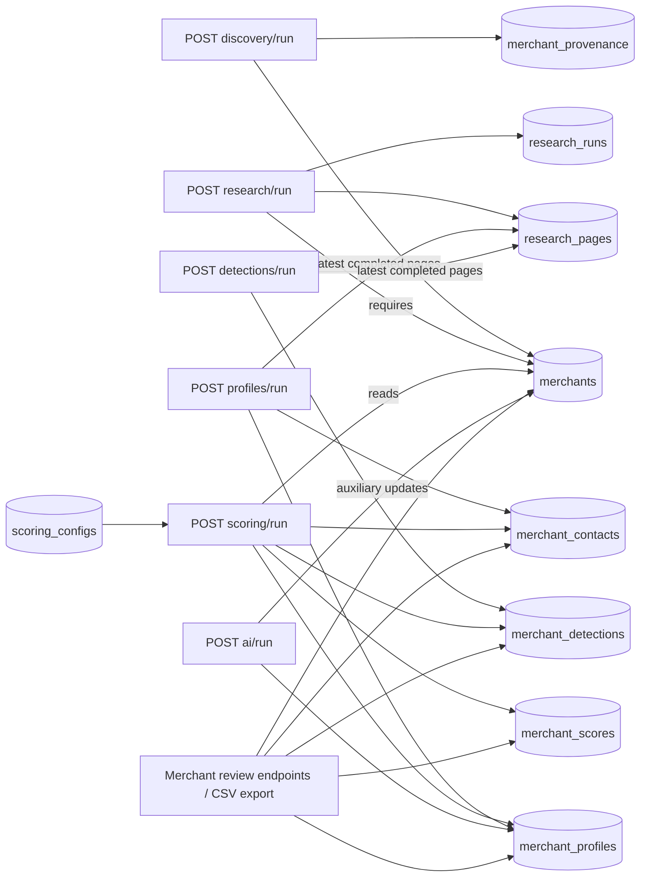
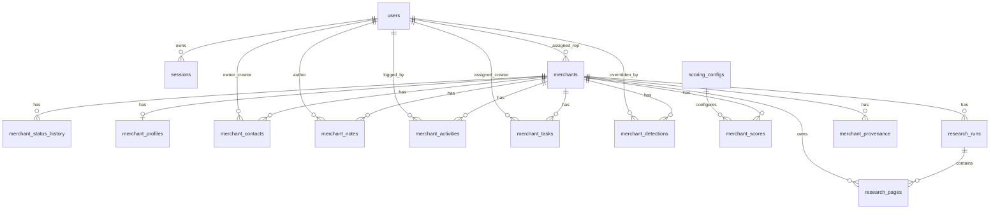

# SurePath backend audit

**Audit date:** 2026-09-15  
**Scope:** the current repository only. This report is a read-only analysis; no source, migration, configuration, or dependency was changed. `npm exec tsc -- --noEmit` was reported passing during the audit. No README, OpenAPI/Swagger contract, seed directory, or automated test suite/test script was found. The only test file is `tests/test-groq.ts`, a live Groq call without assertions.

## Executive assessment

The code implements a workable, synchronous lead-enrichment pipeline, but it is not consistently protected as a CRM/backend boundary. The implemented data flow is **Discovery → Research → Profile → Detection → Scoring**, with review and CSV export APIs. It is DB-coupled: no endpoint calls another endpoint internally.

The largest production risks are authorization gaps (including privilege escalation and API-key-only destructive routes), SSRF/unbounded crawl storage in research, mock-only discovery, incomplete validation and centralized error handling, and concurrency/non-atomic workflow writes. AI is an auxiliary manual flow, not an integrated pipeline stage, and its default configuration has a verified task-key mismatch.

Implementation-state terms below mean: **Fully implemented** = present code performs its named persistence/action; **Partially implemented** = present but meaningful limitation/gap; **Hardcoded/Mocked** = static or test behavior; **Referenced but missing** = code indicates the dependency but no implementation is present. “Not verified from the current codebase” is used where the code does not establish a fact.

## Repository architecture

`src/app.ts` applies `cors()` and `express.json()`, mounts versioned routers, and has an unprotected root health-style message. It has **no application error middleware**. The nominal layout is route → middleware/validator → controller → service → repository → PostgreSQL. Verified exceptions are:

- `health.routes.ts` queries `pool` directly.
- `research-run.controller.ts` queries `merchantRepository` and `researchRunRepository` directly, bypassing a service.
- `merchant-activity.service.ts` and `merchant-task.service.ts` contain direct `pool` SQL, bypassing repository boundaries.
- Routes/controllers commonly call `next(error)`, but no custom error handler is registered; resulting formatting/status behavior is Express-default rather than an API contract.

Global configuration is environment-driven (`DB_*`, `PORT`, `API_KEY`, `SESSION_SECRET`, dashboard credentials, `GROQ_API_KEY`). Database SSL, pool limits, connection timeout, statement timeout, request body limit, security headers, rate limiting, and CSRF controls are not configured in current source. `dotenv.config()` is invoked in both `src/config/database.ts` and `src/server.ts`.

### Actual dependency graph

There is no verified HTTP-to-HTTP dependency. Workflow ordering is implied by the data each service reads, not enforced as a state machine.

## Complete API inventory

Base prefixes are from `src/app.ts`. `A` = `requireApiKey`; `S` = `requireSession`; `Admin` = `requireAdmin`; `V` = express-validator plus `validate`; `—` = absent. All database table names are verified from repository queries/migrations. Parameters are summarized from route/validator/controller source; unvalidated path/query parameters are called out as such.

| Method | Endpoint | Controller → service/repository | Auth / validation | Tables | Response/status / implementation |
|---|---|---|---|---|---|
| GET | `/` | inline app handler | — / — | — | `{message}` 200; Fully implemented |
| GET | `/api/v1/health/` | inline route → `pool.query` | — / — | DB only | `{status,database}` 200/503; direct DB; failure incorrectly retains `status:"ok"`; Fully implemented |
| POST | `/api/v1/auth/login` | auth controller → auth service → user/auth repos | A / body unvalidated | users, sessions | cookie + `{user}` 200; 401/503/500; Partially implemented |
| POST | `/api/v1/auth/logout` | auth controller → auth service → auth repo | A,S / — | sessions | 204/500; Fully implemented |
| POST | `/api/v1/auth/password` | auth controller → auth service → user repo | A,S,V | users | 204, 400/401/422/500; body `username,current_password,new_password`; Partially implemented (username not bound to session user) |
| GET | `/api/v1/users/` | user controller → user service/repo | A,S / query unvalidated | users | `{users}` 200/500; `active_only` exact string handling; Partially implemented |
| POST | `/api/v1/users/` | user controller → user service/repo | A,S,V; **not Admin** | users | `{message,user}` 201/422/500; Fully implemented but authorization defect |
| GET | `/api/v1/users/:id` | user controller → user service/repo | A,S / `:id` unvalidated | users | `{user}` 200/404/500; Fully implemented |
| PATCH | `/api/v1/users/:id` | user controller → user service/repo | A,S,V; **not Admin** | users | `{message,user}` 200/404/400/422/500; role/is_active accepted; authorization defect |
| POST | `/api/v1/users/:id/password` | user controller → user service/repo | A,S,Admin,V | users | 200/404/422/500; `:id` unvalidated; Fully implemented |
| GET | `/api/v1/merchants/` | merchant controller → merchant service/repo | A / V query | merchants, users, research_runs | `{data,pagination}` 200/422; filters `limit,offset,q,status,platform,country,industry,assigned_rep,sort,direction`; no S; Partially implemented |
| GET | `/api/v1/merchants/export` | export controller → export service/repo | A,S,V | merchants, scores, detections, provenance, contacts, users | streamed CSV 200/500; Fully implemented |
| GET | `/api/v1/merchants/:id` | merchant controller → merchant service/repo | A / `:id` unvalidated | merchants (+ joins) | `{data}` 200/404; Fully implemented but API-key-only |
| POST | `/api/v1/merchants/` | merchant controller → merchant service/repo | A,V; no S | merchants | `{data}` 201/409/422; client controls source; Fully implemented but API-key-only |
| PATCH | `/api/v1/merchants/:id` | merchant controller → merchant service/repo + status repo | A,S,V | merchants, merchant_status_history | `{data}` 200/404/422; status history transaction; Partially implemented |
| DELETE | `/api/v1/merchants/:id` | merchant controller → merchant service/repo | A / — | merchants and cascading children | 204/404; destructive API-key-only route; Fully implemented but critical auth defect |
| GET | `/api/v1/merchants/:id/profile` | profile controller → profile service/repo | A / — | merchant_profiles | raw profile 200/404; API-key-only; Fully implemented |
| PATCH | `/api/v1/merchants/:id/profile` | profile controller → profile service/repo | A,S,V | merchant_profiles | raw profile 200/404/422; Partially implemented |
| GET/POST | `/api/v1/merchants/:id/contacts` | contact controller → contact service/repo | GET A / —; POST A,S,V | merchant_contacts, merchants | raw array 200 or entity 201/404/400/422; GET does not distinguish absent merchant; Fully implemented |
| PATCH/DELETE | `/api/v1/merchants/:id/contacts/:contact_id` | contact controller → contact service/repo | PATCH A,S,V; DELETE A,S / parameters unvalidated | merchant_contacts, merchants | 200 or 204/404/400/422; Fully implemented |
| GET/POST | `/api/v1/merchants/:id/notes` | note controller → note service/repo | GET A / —; POST A,S,V | merchant_notes, merchants | raw array 200 or entity 201/404/400/422; GET absent merchant ambiguity; Fully implemented |
| DELETE | `/api/v1/merchants/:id/notes/:note_id` | note controller → note service/repo | A,S / — | merchant_notes, merchants | 204/404; Fully implemented |
| GET/POST | `/api/v1/merchants/:id/activities` | activity controller → activity service/repo | GET A / unvalidated `outreach_only`; POST A,S,V | merchant_activities, merchants, users | raw array 200/404 or 201/400/422; writes activity and merchant timestamp non-atomically; Partially implemented |
| GET/POST | `/api/v1/merchants/:id/tasks` | task controller → task service/repo | GET A / —; POST A,S,V | merchant_tasks, merchants, users | raw array 200/404 or entity 201/400/422; Fully implemented |
| GET/POST | `/api/v1/merchants/:id/detections` | detection controller → detection service/repo | GET A / —; POST A,S,V | merchant_detections, merchants | raw array 200/404 or entity 201/400/422; Fully implemented |
| PATCH | `/api/v1/merchants/:id/detections/:detection_id` | detection controller → detection service/repo | A,S,V | merchant_detections | 200/404/400/422; controller ignores `:id`, enabling cross-merchant-path update; Partially implemented |
| GET | `/api/v1/merchants/:id/scores` | score controller → score service/repo | A / — | merchant_scores, merchants | raw array 200/404; Fully implemented |
| GET | `/api/v1/merchants/:merchant_id/research-runs` | research-run controller → **repos directly** | A,S / — | merchants, research_runs | raw runs 200/404/500; architecture bypass; Fully implemented |
| GET | `/api/v1/merchants/:merchant_id/provenance` | provenance controller → provenance service/repos | A,S,V | merchants, merchant_provenance | raw provenance 200; `current_only`; error delegated to absent handler; Partially implemented |
| GET | `/api/v1/merchants/:merchant_id/status-history` | history controller → service/repo | A / — | merchant_status_history | raw array 200; no merchant-existence check/S; Fully implemented |
| GET | `/api/v1/tasks/summary` | task controller → task service/repo | **—** / — | merchant_tasks | summary 200; public; Partially implemented |
| GET | `/api/v1/tasks/` | task controller → task service/repo | **—** / V query | merchant_tasks, merchants, users | raw queue 200; public; Partially implemented |
| PATCH/DELETE | `/api/v1/tasks/:id` | task controller → task service/repo | S / PATCH V, DELETE —; no A | merchant_tasks, users | 200/204/404/400/422; inconsistent auth; Fully implemented |
| GET | `/api/v1/scoring/config` | config controller → config service/repo | **—** / — | scoring_configs | raw config 200/404; public; Fully implemented |
| PUT | `/api/v1/scoring/config` | config controller → config service/repo | S,V; not Admin/A | scoring_configs | raw config 200/422/500; Partially implemented |
| GET | `/api/v1/scoring/configs` | config controller → config service/repo | **—** / — | scoring_configs | raw array 200; public; Fully implemented |
| POST | `/api/v1/scoring/run` | run controller → scoring run/calculation services → repos | S / **no V** | merchants, configs, scores, contacts, detections, profiles | result 200/400/404/500; body supports merchant selection/limit; Partially implemented |
| POST | `/api/v1/research/run` | research controller → research-run/research services → repos | S,V | merchants, research_runs, research_pages | result 200/404/422/500; Fully implemented with crawl security limitations |
| POST | `/api/v1/profiles/run` | profile-run controller → profile-run/generation services → repos | S,V | merchants, research pages/runs, profiles, contacts | result 200/400; Partially implemented |
| POST | `/api/v1/detections/run` | detection-run controller → run/detection services → repos | S,V | merchants, research pages/runs, detections | result 200/400; static rules; Partially implemented |
| POST | `/api/v1/discovery/run` | discovery controller → discovery/source/provenance services → repos | S,V | merchants, provenance | result 200; mock default/Store Leads unavailable; Hardcoded/Mocked / Partially implemented |
| GET | `/api/v1/industries/` | industry controller → service/repo | S / — | industries | raw array 200; Fully implemented |
| GET | `/api/v1/ai/configs` | AI config controller → service/repo | S / — | ai_configs | raw configs 200; GET lazy-seeds DB; Partially implemented |
| PUT | `/api/v1/ai/configs` | AI config controller → service/repo | S,V; not Admin/A | ai_configs | raw config 200/422; Partially implemented |
| POST | `/api/v1/ai/run` | AI run controller → run/provider/config services → repos | S,V | merchants, profiles, industries, ai_configs | result 200/400/404/500; no ai-run persistence; Partially implemented |

Response formats are not standardized: merchant endpoints commonly wrap `{data}`, users wrap `{users}`/`{user}`, many return raw entities/arrays, validation returns `{detail}`, other failures use `{message}`, and export is CSV.

## Workflow verified from code

### Discovery

`POST /api/v1/discovery/run` uses S + `discoveryRunValidator`, then `discoveryService.runDiscovery`. It defaults `source` to `mock` and `limit` to 25. The mock source returns **one static** candidate: `example.com`, `Example Store`, United States, General, platform unknown, confidence 0.95. `store_leads` always throws `STORE_LEADS_SOURCE_NOT_CONFIGURED` (intended 503); no external Store Leads client/credentials exist. Thus live discovery is **Referenced but missing**.

The service normalizes a domain, finds/creates/updates `merchants`, then writes current provenance for domain/platform/store_name/country/industry. Existing manually overridden provenance blocks automatic field overwrite. Merchant updates and all subsequent provenance writes are separate operations, so a partial state can persist on failure. The controller delegates errors to `next`, yet no app error middleware is present.

### Research

`POST /api/v1/research/run` selects one, multiple, or limited merchants, then runs `researchService.researchMerchant` synchronously. It creates `research_runs`, checks a simplistic `robots.txt`, and sequentially requests nine fixed paths: `/`, `/products.json`, `/about`, `/contact`, `/shipping`, `/returns`, `/refund-policy`, `/privacy-policy`, `/terms`. Each request allows redirects, has a 5-second timeout, up to two retries, and inserts a `research_pages` record. There is a one-second delay after every page. Completion/failure is persisted.

It does **not** verify protocols, resolve/reject private/reserved destinations, revalidate redirect targets, cap response size, or enforce a content-type before reading full text. A caller able to create a merchant then trigger research can use this as SSRF/internal-network probing and create unbounded database content. Robots parsing only identifies a very narrow `User-agent: *` / `Disallow: /` pattern. A partial unique index allows one running run, but concurrent creates rely on a database conflict rather than an idempotent/locked workflow. Research IDs silently omit nonexistent merchants in list selection.

### Profile

`POST /api/v1/profiles/run` uses latest completed research pages. `profileGenerationService` strips HTML with regex, derives title/company, extracts a description and shipping/return policy, and regex-extracts one email/phone. It upserts singleton `merchant_profiles` and conditionally creates one research contact. There is **no `profile_runs` table**, despite the endpoint name. Generated fields receive no provenance. The research upsert can overwrite existing profile fields with null when source pages are absent and does not protect manual profile changes. Selection and processing execute serially.

### Detection

`POST /api/v1/detections/run` reads the latest completed research pages and applies hardcoded in-process rules for Route, Corso, SEEL, Navidium, Extend, and Order Protection. Signals are asset host, explicit phrase, and `/products.json` phrase. Confidence is static: 0.95 asset, 0.80 keyword + product, 0.60 keyword. **Order Protection has no signals and cannot be detected.** Only positives are persisted. An absent/new negative result does not remove historical positives, so `hasDetectedProvider` can remain true indefinitely. The check-then-insert/update logic has no uniqueness constraint or transaction, so concurrent runs can duplicate automated detections.

### Scoring

`POST /api/v1/scoring/run` requires a current active config but has no request validator. It evaluates only enabled `scoring_factors`: contactable; target country; target industry; confirmed platform; no existing detected provider; weak returns coverage. The last is a hardcoded substring list (`no return`, `non-refundable`, `final sale`, etc.). Score = `earnedPoints / possiblePoints * 100`; `score_factors_total` instead counts **all criteria keys**, so it can disagree with enabled/evaluated factors. `Number(undefined)` can yield NaN if configuration flags and weights do not correspond.

Opportunity value is persisted only when all inputs exist:

`estimated_monthly_orders × attach_rate × revenue_per_order`.

Scores are immutable history rows; no latest marker/uniqueness exists. Batch selection and each calculation issue serial per-merchant reads (contacts, detection, profile, then profile again), an N+1 pattern. Missing IDs in a supplied list are silently dropped. Partial batch results are intentional/persisted because no encompassing transaction exists.

### Review, CRM operations, and export

Review reads are available for merchant, profile, contacts, notes, activities, tasks, detections, scores, research runs, provenance, and status history. Most merchant review GET routes require only the API key—not a session—and a number do not verify the merchant exists before returning `[]`. CRM CRUD includes contacts, notes, activities, tasks, merchant status, and manual detections. No record-level ownership or tenant isolation was found.

`GET /api/v1/merchants/export` streams CSV using `pg-query-stream`. It combines merchant values with latest score, current platform provenance confidence, an earliest primary contact, and true detections. Sort choices are constrained by the repository, so SQL injection through sort was not verified. No row cap exists (streaming is intentional). Detections can repeat names because aggregation is not distinct; multiple primary contacts make the selected result only “earliest,” not semantically unique.

### AI auxiliary flow

`POST /api/v1/ai/run` supports `industry_classify`, `research_summary`, and `policy_summary`; it loads active configs/taxonomy and calls the configured provider sequentially for each merchant/task. It writes merchant industry or profile summaries. It is not called by Discovery/Profile/Detection/Scoring, so AI is not an automatic workflow stage.

There is no `ai_runs` migration/table; `ai-run.repository.ts` only reads merchant/profile input. Consequently execution audit/history is **not verified from the current codebase**. A verified default mismatch prevents normal industry execution: AI run looks up key `industry_classify`, while lazy default configuration uses `industry_classification`. `GET /ai/configs` mutates the database by lazy-seeding configs. AI config keys/models/params are broadly accepted; any session user can change them. Raw stored page/profile text enters prompts; output validation checks fields/status but no output length/content bound, retry, timeout, token cap, or provider/model compatibility guarantee was verified.

## Authentication, authorization, validation, and transport controls

Session authentication is reasonably implemented at the cryptographic primitive level: an HttpOnly signed token is HMAC-verified with timing-safe comparison, then its SHA-256 hash is found in `sessions`, expiry is checked, and active user identity/role is attached to `req.user`. API key authentication compares directly to `process.env.API_KEY`. `requireAdmin` exists but is used only for password reset.

Critical verified authorization issues:

1. Any A+S user can create and update users; `requireAdmin` is imported but unused for those routes. User validation allows `role` and `is_active`, so this enables role elevation and account management by a non-admin.
2. Merchant GETs, child GETs, merchant creation, and merchant deletion are API-key-only. DELETE merchant cascades dependent data.
3. Task list and summary are public. Task update/delete are session-only, without API key. Scoring config reads/history are public; config changes are session-only, not admin. AI config changes are session-only, not admin.
4. No merchant/resource ownership, tenant, or role authorization was found. A signed-in user can act on arbitrary records.
5. `PATCH /merchants/:id/detections/:detection_id` ignores the path merchant ID in the controller, allowing an existing detection to be targeted under another merchant path.
6. Password change accepts a body `username` and does not bind it to `req.user`; effects depend on service lookup rather than the authenticated principal.

Validation is present for many create/update/run bodies but absent for login, scoring run, most GETs/deletes, and almost every path UUID. The validation middleware reports every validation error location as `body`, including query/path errors. Selector behavior differs: research/profile/scoring can silently drop unknown supplied IDs, detection rejects one, and absent selectors are often only rejected in services. There is no confirmed authorization-aware schema validation.

The login cookie lacks `Secure`. Default `cors()` is permissive and no credentials policy is explicitly configured. No rate limiting, CSRF protection, header hardening, login throttling, or API-key timing-safe comparison is present. Whether deployment infrastructure supplies these controls is **not verified from the current codebase**.

## PostgreSQL architecture

All primary keys are UUIDs using `gen_random_uuid()`. No migration enabling `pgcrypto` was found; whether the target database supplies it is **not verified from the current codebase**. There are 22 raw SQL migration files; `package.json` invokes `node-pg-migrate up -m migrations`, and raw-SQL compatibility/execution in the deployment environment is not verified from current code.

| Table | Purpose, keys and constraints | Important indexes / observations |
|---|---|---|
| `users` | username NOT NULL UNIQUE; email nullable UNIQUE; display_name nullable; password hash, free-text role default `user`, active flag | no role CHECK/index; `updated_at` has no DB-maintenance trigger |
| `sessions` | token hash UNIQUE; user FK (default restrict); expiry | indexes user and expiry |
| `merchants` | domain NOT NULL UNIQUE; optional platform/name/country/industry; status default `New`; assigned rep FK | no status/industry FK or CHECK; no indexes for common filters or `%ILIKE%` search |
| `merchant_status_history` | merchant FK CASCADE; changer user FK | merchant and changed-time indexes |
| `merchant_profiles` | one-to-zero/one via UNIQUE merchant FK CASCADE; policy/contact/estimates; `tech_stack` JSONB | redundant separate merchant index (UNIQUE already indexes it) |
| `merchant_contacts` | merchant CASCADE; owner/creator user FKs; required name; CHECK email OR phone; confidence/manual flags | merchant/owner/email indexes; no confidence range or unique/partial-primary-contact constraint |
| `merchant_notes` | merchant CASCADE; author user FK; body required | merchant/author/created indexes |
| `merchant_activities` | merchant CASCADE; type required; direction/channel free text; `detail` JSONB | separate merchant/occurred/logger/type indexes; no semantic CHECK/composite chronology index |
| `merchant_tasks` | merchant CASCADE; assignment/creator user FKs; title required | individual merchant/assignment/due/completed indexes; no completion/due consistency CHECK |
| `merchant_detections` | merchant CASCADE; provider and boolean required; evidence JSONB; manual override user FK | merchant/provider/time/manual indexes; no uniqueness or confidence range; lacks `(merchant_id,is_detected)` index |
| `scoring_configs` | UNIQUE version; factor/weight/criteria/assumptions JSONB; active boolean | active/created indexes; no partial UNIQUE guarantee for exactly one active configuration |
| `merchant_scores` | merchant CASCADE; config FK; score/breakdown/inputs and opportunity | merchant/config/time indexes; no range/uniqueness; missing `(merchant_id,scored_at DESC)` for latest query |
| `research_runs` | merchant CASCADE; status CHECK (`running/completed/failed`) | merchant, created DESC, status; partial unique one running merchant; latest lookup composite could improve |
| `research_pages` | run and merchant FKs CASCADE; status CHECK; URL/content/errors | run/merchant/url indexes; DB does not enforce page merchant equals run merchant; no per-run URL/page uniqueness or content size restriction |
| `merchant_provenance` | merchant CASCADE; field/source required, confidence/evidence JSONB, current/manual flags | merchant and merchant+field; partial unique one current value/field; no confidence range |
| `industries` | name UNIQUE, active boolean | active index; merchants retain free-text industry, so no FK taxonomy enforcement |
| `ai_configs` | key, template, model, params JSONB, version, active | key and active indexes plus partial unique one active per key; no `(key,version)` uniqueness |

All listed merchant children cascade on merchant deletion. User-reference FKs use default restrictive behavior because no delete action is specified. Nullable/non-null details are captured above where architecture-critical; full column definitions remain the 001–022 migration files.

## Engineering findings and prioritized remediation backlog

No fixes were implemented. Severity reflects likely confidentiality/integrity/availability impact if this code is deployed as shown.

### Critical

1. **Privilege escalation and unsafe resource authorization.** Enforce admin-only user lifecycle/role changes; session authentication for all CRM reads/writes/destructive routes; record-level/tenant authorization; bind sensitive changes to `req.user`. Correct the detection nested-resource check.
2. **Research SSRF and unbounded ingestion.** Before fetch, strictly permit `http/https`, resolve and reject private/link-local/loopback/reserved addresses, recheck redirects/DNS, constrain ports/content type/size, and use an outbound egress policy. Treat robots as policy, not SSRF protection.
3. **Public task/scoring configuration data and weak transport policy.** Establish deliberate route-level auth/roles, restrict CORS origins/credentials, add Secure cookie in HTTPS production, CSRF protection where cookie auth applies, rate limits, and request size/header security controls.

### High

4. **Mock-only discovery.** Replace or explicitly feature-gate mock default. Implement the verified missing Store Leads adapter only once an actual provider contract/auth is supplied; current code intentionally has neither.
5. **Error/API contract inconsistency.** Add one typed error middleware, map domain errors deterministically, avoid Express default leakage, and standardize success/error envelopes. Correct health failure state.
6. **Non-atomic workflow writes/races.** Transactionally coordinate merchant/provenance changes and activity/merchant timestamp. Make detection/provenance/config version activation concurrency-safe (locking/upsert/appropriate unique constraints). Handle one-running-research conflict intentionally.
7. **AI readiness.** Fix the verified `industry_classify` vs `industry_classification` mismatch, remove GET mutation, restrict configuration to an administrative role, persist run/audit metadata if required, bound provider calls and prompt/output size, and establish model compatibility from an actual contract.
8. **Data integrity.** Decide/enforce status/role/industry taxonomy, primary contact policy, confidence/score ranges, detection uniqueness/staleness policy, score “latest” semantics, and research page/run merchant consistency.

### Medium

9. **Performance.** Batch prefetch scoring inputs or calculate in SQL to remove N+1 queries; avoid duplicate profile read. Batch selector existence checks. Add indexes driven by query plans: merchant filters/search (likely trigram for `%ILIKE%` if extension approved), latest score, primary contact, detection aggregation, and latest completed research. Export’s lateral joins should be measured with real cardinalities.
10. **Long-held synchronous jobs.** Research is at least nine serial requests plus delays per merchant, retries included; all batch run endpoints hold HTTP requests. Adopt a queue/job model and observable run records if operational requirements require scale/retry/cancellation. No such requirement is verified from current codebase.
11. **Validation and semantic controls.** Validate all UUID/query parameters and scoring body; validate configuration schema/weight correspondence; unify batch missing-ID behavior; restrict client-controlled source/status/assignment fields based on policy.
12. **Profile/detection correctness.** Preserve/manual-override semantics for profile fields, write provenance where appropriate, store or supersede negative detection results, and version/static-configure detection rules rather than silently hardcoding them.

### Low / maintainability

13. Remove or consolidate duplicate selection/AI-config transaction paths after verifying callers; move the two direct service SQL usages behind repositories. Avoid insert-then-select where `RETURNING` can provide needed shape.
14. Add a test runner and deterministic unit/integration tests for auth matrix, workflow state, race cases, migrations, export escaping, validation, and SSRF defenses. The existing Groq script is not an automated regression test.
15. Publish an OpenAPI contract and repository runbook/migration/environment documentation. They are not present in the current codebase.

## Static, mock, and referenced-but-missing audit

| Item | Current verified behavior | Classification |
|---|---|---|
| Discovery source | default `mock`; one `example.com` candidate with static enrichment/confidence | Mocked/Hardcoded |
| Store Leads | always `STORE_LEADS_SOURCE_NOT_CONFIGURED`; no external adapter found | Referenced but missing |
| Research | fixed page list, delay/retries/timeouts/User-Agent | Hardcoded operational behavior |
| Detection | six static provider definitions; Order Protection has no detecting signals; static confidence levels | Hardcoded/Partially implemented |
| Weak returns scoring | static phrase list | Hardcoded business rule |
| AI | Groq API key/provider path exists; default config/task mismatch; no execution table | Partially implemented |
| CRM statuses | literals such as `New`, `Live`, `Lost` are used without DB enum/check | Partially constrained |
| Docs/contracts/seeds | no README/OpenAPI/Swagger/seed files found | Not verified from the current codebase |

## Final conclusion

SurePath has the core persistence and synchronous enrichment operations needed to demonstrate the intended CRM pipeline. However, it should not be considered production-ready without resolving authorization and SSRF first, then workflow atomicity, validation/error contract, mock integration boundaries, and data integrity/performance controls. The codebase does not establish a complete external API contract, production deployment controls, provider contract, or test coverage; those aspects are not verified from the current repository.
